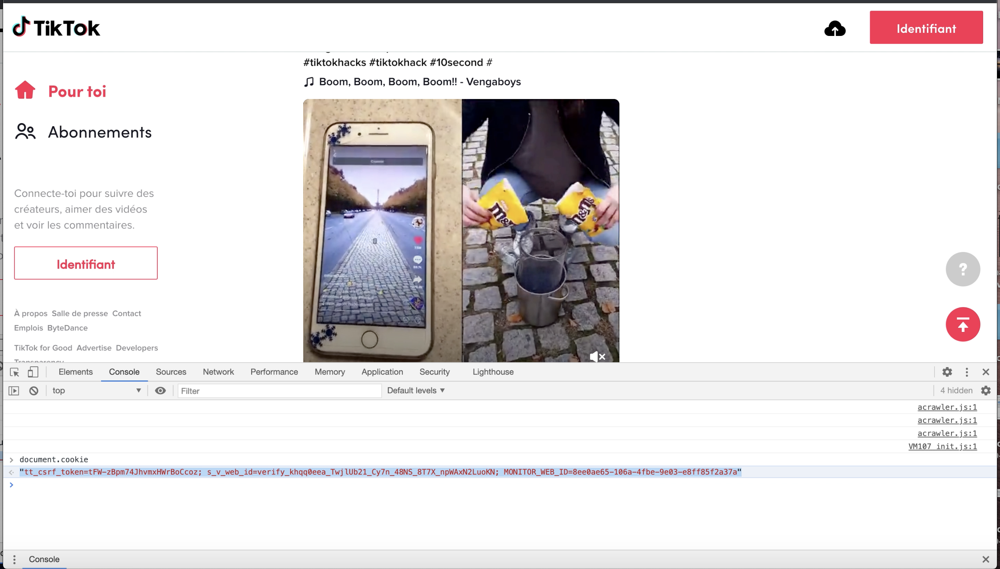

<!-- README.md is generated from README.Rmd. Please edit that file -->

```{r, include = FALSE}
knitr::opts_chunk$set(
  collapse = TRUE,
  eval = F,
  comment = "#>",
  fig.path = "man/figures/README-",
  out.width = "100%"
)
```

# tiktokr

<!-- badges: start -->
[](https://www.tidyverse.org/lifecycle/#experimental)
[](https://codecov.io/gh/benjaminguinaudeau/tiktokr?branch=master)
[](https://travis-ci.com/benjaminguinaudeau/tiktokr)
<!-- badges: end -->

The goal of `tiktokr` is to provide a scraper for the video-sharing social networking service [TikTok](http://tiktok.com/). Mostly inspired by this Python module: [davidteather/TikTok-Api](https://github.com/davidteather/TikTok-Api). You will need Python 3.6 or higher to use `tiktokr`.

## Installation

You can install the development version from [GitHub](https://github.com/) with:

```{r eval = F}
# install.packages("devtools")
devtools::install_github("benjaminguinaudeau/tiktokr")
```

Load library

```{r example}
library(tiktokr)

```

Make sure to use your preferred Python installation

```{r}
library(reticulate)

use_python(py_config()$python)

```

Install necessary Python libraries

```{r, eval = F}
tk_install()
```


## Authentification

In November 2020, Tiktok increased its security protocal. They now frequently show a captcha, which is easily triggered after a few request. This can be solved by specifying the cookie parameter. To get a cookie session: 

1. Open a browser and go to "http://tiktok.com"
2. Scroll down a bit, to ensure, that you don't get any captcha
3. Open the javascript console (in Chrome: View > Developer > Javascript Console)
4. Run `document.cookie` and use the output as a cookie param when querying

[](https://youtu.be/kYMV2ugxacs)

```{r}
cookie <- "<paste here the result from document.cookie>"
```

## Examples

First you need to initialize `tiktokr`

```{r}
tk_init()
```


### Get TikTok trends

Returns a tibble with trends.

```{r, eval = F}
# Trend
trends <- tk_posts(scope = "trends", n = 200, cookie = cookie)

```


### Get TikToks from User

Note: User query often only provides 2k hits but limit is unclear. Sample seems to be from most recent to oldest.

```{r, eval = F}
user_posts <- tk_posts(scope = "user", query = "willsmith", n = 50, cookie = cookie)

```


### Get TikToks from hashtag

Note: Hashtags query only provides 2k hits, which are not drawn randomly or based on the most recent post date but rather **some mix of recency and popularity** of TikToks.

```{r, eval = F}
hash_post <- tk_posts(scope = "hashtag", query = "maincharacter", n = 100, cookie = cookie)


```

### Download TikTok Videos

With `tk_dl_video` you can download videos from TikTok.

From Trends:

```{r, eval = F}
trends <- tk_posts(scope = "trends", n = 5)

trends %>%
  split(1:nrow(.)) %>% 
  purrr::walk(~{tk_dl_video(.x$downloadAddr, paste0("video/", .x$id, ".mp4"))})

```

From hashtag:

```{r, eval = F}

hash_post <- tk_posts(scope = "hashtag", query = "maincharacter", n = 5, cookie = cookie)

hash_post %>%
  split(1:nrow(.)) %>% 
  purrr::walk(~{tk_dl_video(.x$downloadAddr, paste0("video/hashtag/", .x$id, ".mp4"))})

```


